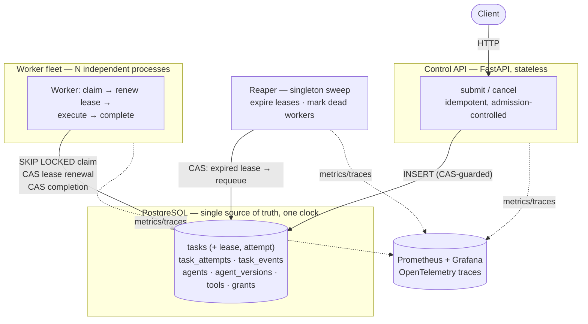
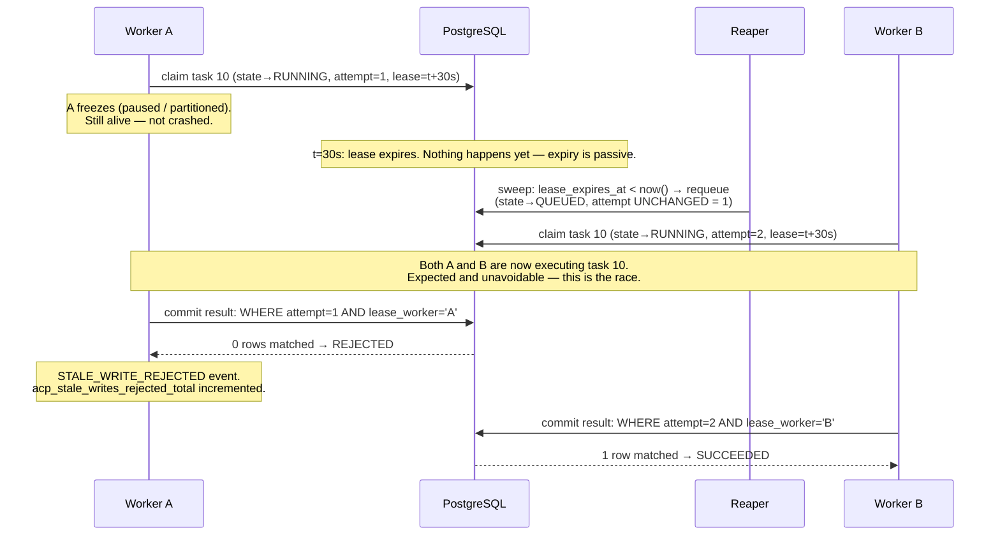

# AI Agent Control Plane

Distributed scheduler and durable execution engine for AI agent workloads — built around lease-based ownership, monotonic fencing tokens, and compare-and-set state transitions, so that worker crashes, retries, and duplicate submissions are handled by construction, not by hope.

**AI agents are the workload. Distributed systems is the project.**

`Python · FastAPI · PostgreSQL · SQLAlchemy Core · Docker · Prometheus · Grafana · OpenTelemetry`

> **Status:** all 11 planned phases implemented. 303 tests passing (unit, integration, concurrency, chaos). Real benchmark numbers in [`docs/BENCHMARKS.md`](docs/BENCHMARKS.md) — nothing in this document is estimated. See [Recommended Engineering Improvements](#recommended-engineering-improvements) for the gaps left open on purpose.

---

## The problem

Running one AI agent is easy: call a model, call a tool, return a result. Running agent workloads across a fleet of concurrent workers is not, because:

- **workers crash** mid-task, holding no record of how far they got
- **workers stall** without crashing — partitioned, paused, or just slow — and may still be running when you've given up on them
- **leases expire**, and the task has to go to someone else *without* letting the original worker come back and overwrite the new result
- **retries** must not blow through a downstream dependency that's already struggling, or duplicate a side effect that already landed
- **duplicate submissions** (a client retrying a timed-out request) must collapse to one task, not create a second one
- **many workers compete** for the same queue without a central dispatcher becoming the bottleneck
- **overload** has to degrade a misbehaving tenant's own throughput, not take the whole system down with it

This project is a control plane that answers each of those with a specific mechanism — not a chatbot, not a prompt-orchestration framework, not an LLM API wrapper. The agents in it are deliberately uninteresting (simulated adapters, no external API calls) so that every test and every benchmark measures the scheduler, not somebody else's API latency.

## Architecture



**Three deployables, not ten.** API, worker, reaper — split where failure domains actually differ. Everything inside them shares a single PostgreSQL transaction; splitting transactional code across a network turns one ACID commit into a distributed saga for no benefit at this scale.

## Core engineering mechanisms

Every mechanism below exists to prevent a specific failure — not as a generic claim of "fault tolerance."

| Mechanism | What it prevents |
|---|---|
| **Compare-and-set state transitions** — every write is `UPDATE … WHERE state=? AND attempt=? AND lease_worker_id=?` | Two workers, or a worker and the reaper, ever agreeing on which one owns a task |
| **Monotonic fencing token** (`tasks.attempt`), allocated by the *same* `UPDATE` that grants the lease | A worker that lost its lease from writing a result after someone else has already taken over |
| **One clock** — `lease_expires_at` computed and compared only by PostgreSQL, never a worker's local clock | A worker with clock skew believing it still owns an expired lease |
| **`SKIP LOCKED` claiming** over a partial index (`idx_tasks_ready`) | A central dispatcher becoming a bottleneck; N workers claim disjoint rows without blocking each other |
| **Full-jitter exponential backoff**, chosen per failure class (rate-limited vs. timeout vs. permanent) | A thundering herd of retries hitting a dependency at the exact moment it's recovering |
| **Idempotent submission** via a partial unique index on `(tenant_id, idempotency_key)` | A client's retried request creating a second task |
| **Per-tenant admission control**, checked before global overload | A tenant over its own quota being told "the system is struggling" when the honest answer is "you are" |
| **Claim-time authorization snapshot** for agent tool calls | An agent gaining a tool grant mid-execution; revocation latency bounded by attempt duration, not a cache TTL |

## The stale-worker race

This is the failure the whole design exists to survive, and it's reproduced **deterministically** — no sleeps, no timing luck — in [`tests/chaos/test_stale_worker_race.py`](tests/chaos/test_stale_worker_race.py):



The mechanism: `attempt` is a fencing token allocated by the **same** `UPDATE` that grants the lease, so ownership and token can never disagree. Recovery (`RUNNING → QUEUED`) never bumps it — only the next claim does — so a worker that comes back late presents a stale token and matches zero rows on every write it attempts. Exactly one attempt is ever recorded `SUCCEEDED`; the stored result is the live owner's.

This does **not** stop Worker A's real-world side effects (an API call it made while frozen already happened). It stops the *database* from ever recording two committed outcomes for one task. See [Execution semantics](#execution-semantics) for exactly what is and isn't guaranteed.

## Testing strategy

The test suite is layered by what each layer proves — not "a comprehensive test suite," specific guarantees with specific tests:

| Layer | Proves | Example |
|---|---|---|
| `tests/unit/` (no database) | The state machine's full legality table — all 25 ordered state pairs, not a sample | [`test_state_machine.py`](tests/unit/test_state_machine.py) |
| `tests/concurrency/` (real Postgres, real contention) | 50 concurrent transactions racing to claim one row produce exactly one winner | [`test_transition_cas.py`](tests/concurrency/test_transition_cas.py) |
| `tests/chaos/` (deterministic, no sleeps) | The stale-worker race above, plus: a reaper that reclaims a task never loses to a worker that renews just in time; concurrent reap-vs-completion produces exactly one outcome | [`test_stale_worker_race.py`](tests/chaos/test_stale_worker_race.py) |
| `tests/integration/` (real Postgres, full stack) | Idempotent submission under 25 concurrent duplicate requests; per-tenant admission isolation (one busy tenant can't lock another out); an `EXPLAIN`-based regression test asserting the claim query hits its index with **no Sort node** | [`test_idempotent_submit.py`](tests/integration/test_idempotent_submit.py), [`test_admission_control.py`](tests/integration/test_admission_control.py), [`test_claim_plan.py`](tests/integration/test_claim_plan.py) |

The `EXPLAIN` test is worth calling out specifically: a correctness test cannot catch a missing index, because the query returns identical rows whether PostgreSQL sorts 2,000 rows in memory or walks an index that's already in the right order. Only reading the actual query plan catches it.

```bash
.\make.ps1 test-unit    # pure domain — no database, ~0.05s
.\make.ps1 test-db      # integration + concurrency, real PostgreSQL
.\make.ps1 test-race    # concurrency suite ×20, to prove it isn't flaky
```

## Failure model

| Scenario | Detection | System behavior |
|---|---|---|
| Worker crashes (`SIGKILL`) | Lease expiry, noticed by the reaper | Task requeued within `lease_ttl + reaper_period`; attempt recorded `LOST` |
| Worker stops heartbeating | Missed heartbeat window | Worker marked dead; its **next** heartbeat attempt is rejected, so it self-fences and exits rather than keep claiming |
| Lease expires | Reaper sweep (`lease_expires_at < now()`) | `RUNNING → QUEUED`, attempt token unchanged, ready for reclaim |
| Stale worker returns and tries to write | CAS predicate on `(state, attempt, lease_worker_id)` | Write matches 0 rows → rejected, counted in `acp_stale_writes_rejected_total`, task keeps the new owner's result |
| Graceful shutdown (`SIGTERM`) | Self-reported drain | Unfinished work handed back immediately (`available_at = now()`); recovery ≈ 0s instead of waiting out the lease |
| Duplicate submission | Partial unique index on `(tenant_id, idempotency_key)` | Second request returns the **same** task, `200` instead of `201` — never a second row |
| Task fails (retryable) | Failure classified (rate-limited / timeout / permanent / unknown) | Requeued with full-jitter exponential backoff sized to the failure class; a killed worker's task retries with **zero** backoff, since the task itself didn't misbehave |
| Task fails (permanent / bad input) | Failure classified as non-retryable | Marked `FAILED` immediately — never burns retry budget on an error that can't change |
| Tenant capacity exhausted | Exact per-tenant queue-depth count | `429`, with `Retry-After` — this tenant's own backlog, independent of system health |
| System-wide overload | Approximate, Prometheus-cached global queue depth | `503`, with `Retry-After` — checked only *after* tenant quota clears, so it's never a cover for a tenant's own problem |
| PostgreSQL unavailable | Every query fails | **Total outage — the accepted single point of failure.** Workers abort in-flight tasks rather than commit results they can't prove they still own |

## Execution semantics

Stated precisely, because "fault-tolerant" and "exactly-once" are usually where a project's honesty runs out:

| Property | Guarantee |
|---|---|
| Delivery | **At-least-once.** A task can be handed to more than one worker (see the stale-worker race above). |
| Committed outcome | **At-most-once.** The CAS predicate guarantees exactly one attempt ever writes a terminal state. |
| Side effects | **At-least-once, and only as strong as the downstream system's own idempotency.** Fencing stops the database from recording two outcomes; it does **not** undo an HTTP call a stale worker already made before it lost ownership. |
| Ordering | None guaranteed across attempts. Retry N does not know what retry N-1 did unless the adapter itself is idempotent. |
| Concurrent execution | Possible and expected during a lease handoff — Worker A and B can both be running the same task briefly. Only one commit wins. |

**What fencing protects:** the row in `tasks` — its state, its result, its terminal outcome. **What it does not protect:** anything the stale worker did to the outside world before its write was rejected. There is no two-phase commit between this system and an external API, so this project does not claim exactly-once execution — that claim is only honest with a transactional sink, and this system doesn't have one.

## Observability

Metrics are namespaced `acp_*`, and cardinality is treated as a design constraint rather than an afterthought: `task_id`, `worker_id`, and `idempotency_key` are never label values. (`worker_id` is the subtle one — worker identities are generation-unique per process start, so using it as a label would mint a new time series on every deploy. A unit test enforces this.)

Metrics worth knowing about: `acp_stale_writes_rejected_total` (non-zero is *proof* the fencing token is doing its job), `acp_leases_expired_pending` (the single best alert — non-zero and rising means the reaper is behind), `acp_recovery_latency_seconds` (measures reality against the design bound), `acp_queue_wait_seconds`, `acp_admissions_total{decision}`.

Distributed tracing (OpenTelemetry) links the submitting request's span to the executing worker's span **as a link, not a parent** — a task can sit queued long enough that the submitting span has already ended by the time a worker claims it, so a parent/child relationship would render as broken in most trace viewers.

## Demo: kill a worker mid-flight

```bash
docker compose up -d --build --scale worker=5
python scripts/demo_chaos.py
```

Submits 300 tasks (half with genuine multi-second duration, so there's real in-flight work — an instant workload would drain before the kill ever landed on anything), waits until ≥10 are running, then `docker kill`s one worker container outright. A real run:

```
lease_expirations_total           13   (tasks the killed worker was holding)
task_recoveries_total{requeued}   13   (reclaimed and re-run by a live worker)
stale_writes_rejected_total        0   (correct — a killed process cannot write)
tasks lost                         0
```

A second demo (`python scripts/demo_governance.py`) proves the tool-authorization path at runtime: an agent granted `web-search` succeeds; a different agent reaching for a tool it was never granted is refused with `PERMISSION_DENIED`, verified in both the task's event timeline and a separate audit log.

## Quick start

Requires Docker and Python 3.12. On Windows use `.\make.ps1`; the `Makefile` mirrors it on Linux/macOS.

```bash
.\make.ps1 setup     # venv + dependencies
.\make.ps1 up        # PostgreSQL on :5434
.\make.ps1 migrate   # alembic upgrade head
.\make.ps1 test      # full suite
```

Full stack with a worker fleet:

```bash
docker compose up -d --build --scale worker=3
```

| Service | URL |
|---|---|
| Control API + OpenAPI docs | http://localhost:8001/docs |
| Prometheus | http://localhost:9091 |
| Grafana (anonymous admin) | http://localhost:3002 |

### Submit a task

```bash
TENANT=$(curl -s -X POST http://localhost:8001/v1/tenants \
  -H "Content-Type: application/json" -d '{"name": "acme"}' | jq -r .id)

curl -s -X POST http://localhost:8001/v1/tasks \
  -H "Content-Type: application/json" \
  -d "{\"tenant_id\": \"$TENANT\", \"task_type\": \"demo.agent\", \"payload\": {}}"
```

Submitting the same request again with an `idempotency_key` returns the same task (`200`) instead of creating a second one (`201`).

## Repository structure

```
src/acp/
  domain/       pure logic — state machine, retry policy, authorization
                (no I/O; enforced by an import-boundary test)
  db/queries/   the only place CAS/claim/lease SQL lives
  api/          FastAPI app, routes, admission control
  worker/       the worker process — claim, renew, execute, complete
  reaper/       singleton sweep — expired leases, dead workers
  scheduling/   claim policy (pure) vs. claim mechanism (SQL), kept separate
  obs/          Prometheus metrics, structured logs, OpenTelemetry tracing
migrations/     Alembic — run against a real Postgres in every test session
tests/
  unit/         pure domain logic, no database
  integration/  real Postgres, full request/worker flows
  concurrency/  genuine contention, not mocked locking
  chaos/        deterministic failure injection, no sleeps
load/           benchmark harnesses (throughput, recovery latency)
scripts/        the two live demos
docs/           architecture rationale, benchmarks
```

## Tradeoffs

- **PostgreSQL as the queue, no Redis.** `SKIP LOCKED` over a partial index is a production-grade queue at this scale. A second store means a second source of truth for no measured benefit yet — Redis earns its place when a benchmark shows claim contention or rate-limiting as the actual bottleneck.
- **Pull-based claiming, no central dispatcher.** A central scheduler is a singleton bottleneck needing leader election. Policy (what to prioritize) is still a separate, pure module from mechanism (the SQL), so the two can evolve independently.
- **Tenant limits enforced at claim time, not submit time** — a busy tenant degrades in latency, not in errors.
- **No Kafka.** This needs per-item random-access mutation (extend this lease, cancel that task) — the opposite of what an append-only log is for.
- **No Kubernetes.** It schedules containers; this schedules tasks, which is the actual interesting problem here.

## Recommended Engineering Improvements

Gaps left open deliberately, not hidden:

- **Hung-worker detection is missing.** A worker that keeps renewing its lease but is actually stuck in an infinite loop is never detected — there's no `max_execution_time` ceiling yet. The fix is straightforward (compare `task_attempts.started_at` against a cap in the reaper sweep) but isn't built.
- **PostgreSQL is a single point of failure.** Accepted for this stage of the project; a real deployment would need a Patroni/HA setup, which is out of scope here.
- **Capability-aware claiming degrades under a specific load shape.** A specialist worker facing a deep queue of work it can't run scans the whole queue (measured at ~47ms for a 2,000-row queue) because capability matching is a filter, not part of the index key. `tasks.capability_key` already exists, unused, for the keyed-index fix.
- **No checkpointing.** A retried task reruns from the beginning; there's no mechanism to resume a long-running agent from its last completed step. Scoped out of this project on purpose — it's the highest-effort, lowest-marginal-insight remaining phase.
- **Tenant concurrency limiting is a soft check**, not a hard atomic counter — under heavy concurrent claiming a tenant can briefly overshoot its `max_concurrent_tasks`. Bounded, but not exact.

## Roadmap

| Phase | Status |
|---|---|
| 0 — skeleton, migrations, CI | ✅ |
| 1 — state machine, CAS, idempotent submit, Control API | ✅ |
| 2 — worker registry, `SKIP LOCKED` claim, leases | ✅ |
| 3 — reaper, recovery, fencing, chaos suite | ✅ |
| 4 — metrics, structured logs, Prometheus/Grafana | ✅ |
| 5 — failure classification, retry policy, backoff | ✅ |
| 6 — agent registry, immutable agent versions, routing | ✅ |
| 7 — tool registry, versioned grants, runtime authorization, audit log | ✅ |
| 8 — capability-aware placement | ✅ |
| 9 — admission control, backpressure, 429 vs 503 | ✅ |
| 10 — OpenTelemetry tracing, Grafana dashboards, the two demos | ✅ |
| 11 — benchmarks with methodology | ✅ |
| 12 — checkpointing (optional, not planned near-term) | ⬜ |

Full technical rationale — architecture decisions, tradeoff analysis, benchmark methodology — lives in [`docs/BENCHMARKS.md`](docs/BENCHMARKS.md) and inline in the source; every module docstring explains the *why*, not just the *what*.
